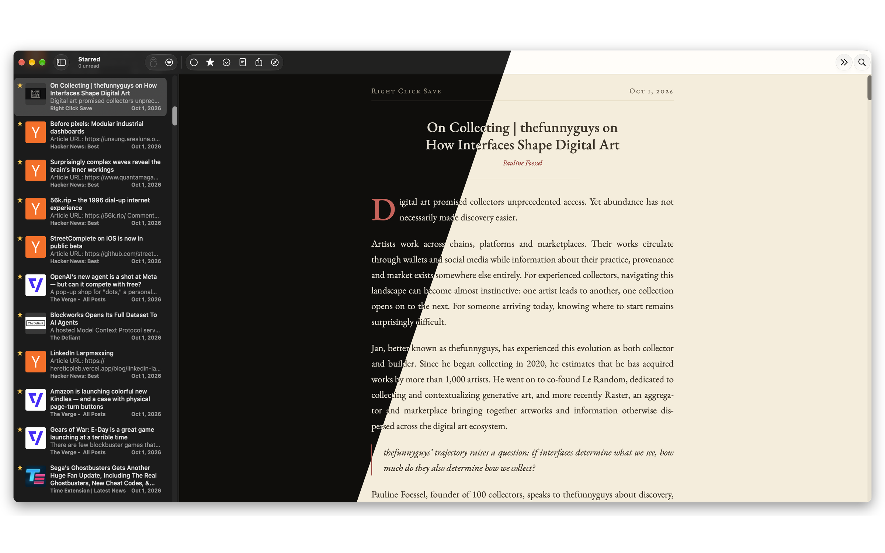

<!-- nnw-theme-identity:start -->
# Prayer Book

A NetNewsWire theme by [Benjamin Meadows](https://thebenmeadows.com/).
<!-- nnw-theme-identity:end -->

The design is taken from [OrthodoxPrayers.net](https://orthodoxprayers.net/), a prayer book for the browser: EB Garamond, a parchment page by day and a vigil page by night, red for every link and label, justified and hyphenated text, and a red capital that drops two lines at the start of each article.

## Install

On iOS and macOS, open this link on the device:

`netnewswire://theme/add?url=https://github.com/mdws-org/nnw-prayer-book/releases/latest/download/Prayer.Book.nnwtheme.zip`

Or download `Prayer.Book.nnwtheme.zip` from the [latest release](https://github.com/mdws-org/nnw-prayer-book/releases/latest), unzip it, and on the Mac double-click the `.nnwtheme` folder. On iOS, put the unzipped folder in iCloud Drive and choose it under Settings → Article Theme → Add Theme.

Day and Night follow the system appearance.

## Article layout

- The running head has the feed name at the left and the date at the right on one hairline, as a printed book heads its pages.
- The byline is set as a red italic attribution under the title.
- Links are red with no underline at rest, and a heavier underline on hover. This is the register the printed books use for rubrics: red marks what is not the text.
- The drop cap goes on the first text paragraph, however deep the feed wraps it. Quotations, lists, captions, tables, image-only paragraphs, posts with no title (Mastodon, Bluesky), and aggregator feeds whose first lines are "label: link" (Hacker News, Lobsters) take no capital.
- Headings are red small capitals, centered. Quotations are italic with a red hairline at the margin. Code sits on a wash of the paper in the system monospace.
- `lang="en"` on the article wrapper is what turns hyphenation on: NetNewsWire's page does not declare a language, and WebKit does not hyphenate without one. Articles in other languages get English break points.

## Build

`src/` is the source. `build.sh` embeds the two EB Garamond files into `stylesheet.css` as data URIs (NetNewsWire cannot load a font file from inside a bundle) and writes the bundle. `./build.sh --install` also copies it into NetNewsWire's Themes folder on this Mac. Edit `src/`, never the bundle.

`fixtures/` holds articles from live feeds (The Verge, Ars Technica, Daring Fireball, Platformer in feed and Reader View shape, Hacker News, r/programming, Mastodon, YouTube, Simon Willison, the Rust blog). `npx nnw-theme@2 check` renders every fixture through NetNewsWire's own template and scripts in WebKit for iPhone, iPad and Mac, light and dark. `fixtures/refresh.py <dir>` fetches fresh ones.

## Licenses

The theme's stylesheet and template are under the Zero-Clause BSD license in `Prayer Book.nnwtheme/LICENSE`. EB Garamond is embedded under the SIL Open Font License, reproduced in `Prayer Book.nnwtheme/NOTICE.txt`. The repository's tooling files come from [dave-atx/netnewswire-theme-template](https://github.com/dave-atx/netnewswire-theme-template) under Apache 2.0 (`LICENSE`).
